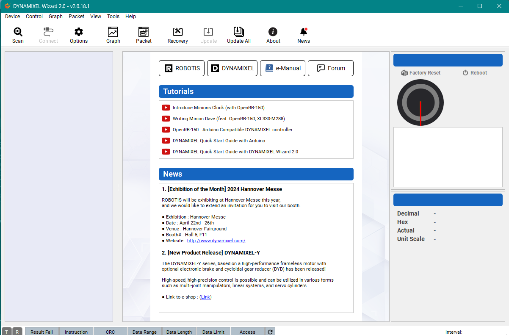
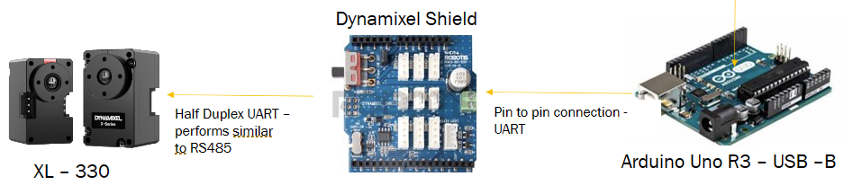

# Firmware
Please read the main Readme before reading this. 
There solutions are provided 
1) Using `esp32s3` (8MB for RAM) - Developed by [adaptive-intelligent-robotics](https://github.com/adaptive-intelligent-robotics/Qutee_v2)
   - wifi ✅, self-processing ✅, usb-debugging ❌
2) Using `Arduino Uno` and potentially wifi `Nano-esp32` (very powerful at 16MB of RAM for a microcontroller). Self-development
   - wifi ✅, self-processing ✅, usb-debugging -`testing`
3) Using `U2D2 device` (No RAM). Self-development
   - wifi ❌, self-processing ❌, usb-debugging ✅
###
- #### For the first solution please visit the repository made by the original developers.

### Hardware preparation 

- Before we do anything with the code the Dynamixel motors are needed to be set up so that all three solutions are usable.
- The servos when they come in, all have the `ID = 1`, which needed to be changed to `11`, `12`, `13`, `21`, `22`, `23`, `31`, `32`, `33`, `41`, `42`, `43`
- This can be done using the `U2S2` device and `Dynamixel Wizard` Application [Dynamixel](https://emanual.robotis.com/docs/en/software/dynamixel/dynamixel_wizard2/)
  - Please download this application on your PC.
  - Then connect the U2D2 device with the PC using USB-A and start the `Dynamixel Wizard`.
  - Just to be sure you must select to update the firmware on the servo
    - Select the right model and upload firmware
    - Then hit scan 
    - and now you will see your servo
    - set the ID to the ones given above
    - Note: do this one by one: do not daisy-chain them 
    - 
- We must now continue to create Y cables out of the two given 3 pins wires (`GND`, `VAT`, `DATA`). 
This is because either if we use U2D2 PHB, or the Dynamixel shield solutions or the U2D2 solution, we still will have only two available 3pin Dynamixel slots. We need four legs.
- Thus 2, 3pin wires must be crimped. 

### Solution 1
- For the first solution, one must connect the GND pin on the ESP32s3 to the GND pin on one of the sockets of the 3 pin ports on the PHB.
Then the VBat to the VAT line and use crimps to connect two wires which are soldered to A0 and A1, which then connects to the data line on the PHB.
    - 
- Then use the remaining two ports to connect to the Y cables created earlier for four legs. Each port will control two legs
- Now we can daisy-chain the legs.
- Remember to keep the order on 
  - `leg 1` - `11` , `12`, `13`
  - `leg 2` - `21` , `22`, `23`
  - `leg 3` - `31` , `32`, `33`
  - `leg 4` - `41` , `42`, `43`
 - Software solution for this should be followed as instructed by the Original Developers on the given url.

### Solution 2
- For the second solution, using the Arduino boards one must download the Arduino IDE
- then through package manager, one must download the Arduino Uno Support Libraries
- Still in testing later use for processing and cloud connection download `Nano ESP32 Arduino` library as well.
- The next thing that one needs are the `DynamixelSheild` and `Adafruit_BNO055` library. This has to be downloaded via Library Manager as well.
- The current status of this solution is that it can walk, WiFi and imu will be added later using the `Nano ESP32 Arduino`
- Here the hardware components are easier to manage. 
  - Connect the Arduino Board and the Sheild by stacking them, they should fit perfectly.
  - Connect the four terminal servos as solution 1 to the shield just like to the PHB. 
  - Move the shield switch to UART and upload the `solution_flash.ino` file onto the board.
  - Hit RsT button 
  - The robot should start moving
  - disconnect batteries to stop.
  - 

### Solution 3
- This is using the U2D2 and the PHB set for it 
- For this you would need to set up the `USB - A` Connection between the PC and the U2D2 device.
- This device can be mounted on top of the PHB board and connect to the pin board using Dynamixel 3 pin cables.
- Now the set up of the motors should be the same as Solution 1, where the remaining 3 pin sockets should be connected to the Y cable, each managing two legs worth of servos.
- Before running the code run
  - ```shell
    pip3 install dynamixel_sdk
    ```
- Run the code, remember to replace the `Dev/ttyACM0` with your correct port.
- If running on WSL make sure to download `USBIPD-WIN` and use binding to use port.
  - ```shell
    usbipd list
    usbipd bind  --busid <your-bus-id>
    usbipd attach --wsl --busid <your-bus-id>
    ```
- You can use docker to build this solution by using the Dockerfile as well. But remember to allow Docker to share port as well.


    


