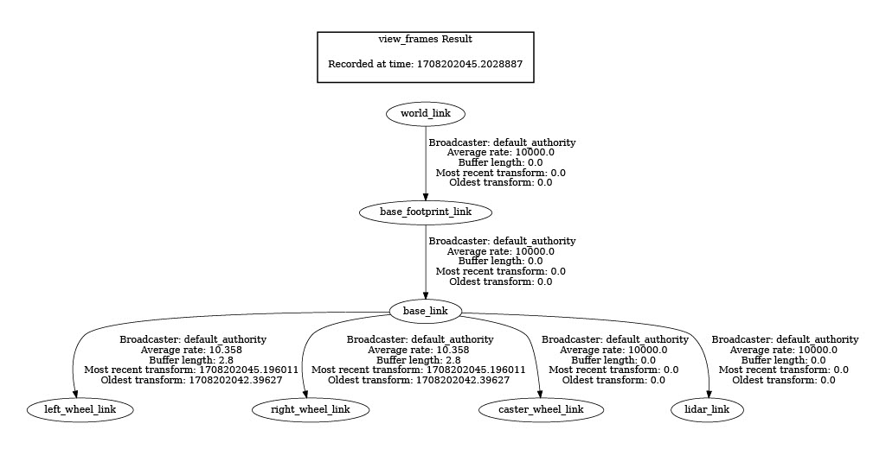

# <center>URDF File Notes</center>

> URDF files ("Unified Robot Description Format") are used as a common language to describe robots based on XML format  
>
> Download URDF extension in VSCode 

---  

### <center>Table of Contents</center>  
|Item|Heading|Sub Contents|
|:---:|:---:|:---:|
| **1.** | [Reference Links](#reference-links) ||
| **2.** | [Overview](#overview) | [Common joint types](#common-joint-types) |
| **3.** | [Template With Description](#template-with-description) | |
| **4.** | [Including Xacro](#including-xacro) | [Main file](#main-file),<br>[Included file](#included-file),<br>[Placeholders](#placeholders),<br>[Xacro notes](#xacro-notes) |
| **5.** | [Creating a URDF File Process and Visualisation](#creating-a-urdf-file-process-and-visualisation) | [Create basic file](#create-basic-file),<br>[Setup environment](#setup-environment),<br>[Visualise urdf](#visualise-urdf),<br>[Further changes and reloading](#further-changes-and-reloading),<br>[Define next link and joint](#define-next-link-and-joint),<br>[Add base_footprint](#add-base_footprint),<br>[Add world_link](#add-world_link),<br>[View TF tree](#view-tf-tree) |

<br>

[⬆ Table of Contents ⬆](#urdf-file-notes)    

---  

### <u>Reference Links</u>  

[ROS-Industrial Website: Intro to URDF](https://industrial-training-master.readthedocs.io/en/melodic/_source/session3/Intro-to-URDF.html)
[Wiki.ros.org/urdf](https://wiki.ros.org/urdf)  
[Links](https://wiki.ros.org/urdf/XML/link)
[Joints](https://wiki.ros.org/urdf/XML/joint)

[⬆ Table of Contents ⬆](#urdf-file-notes)    

---  

### <u>Overview</u>  

* A robot consists of [links](https://wiki.ros.org/urdf/XML/link) and [joints](https://wiki.ros.org/urdf/XML/joint)  
* First break physical robot down into separate `links` (rigid parts of robot)  
* If two separate parts can move independently of each other, then they will need to be separate `links`. They should also be separate, if two parts make sense to be separate (e.g. removable modules or sensors)  
* Choose where origin for `link` should be, doesn't matter too much with exception of rotating links which should be at center of rotation  
* Connections between `links` are `joints` which describe where `links` are in space  
* Each `link` apart from the first one, will have a corresponding `joint` that says what other `link` its connected to (its parent), and how its connected to the parent  
* Each `link` can only have one parent, but can have many child `links`  

<br>  

* Describing joints, we need to specify what **type** of motion it has.  

##### Common joint types:  

|Type|Description|Example|
|:--|:--|:--|
| Revolute | Rotational motion about a point with a fixed start and stop angle (fixed limits) | Robotic arm |
| Continuous | Rotational motion about a point with no fixed limits (can spin freely forever) | A wheel or spinning gripper that can rotate continously |
| Prismatic | Linear translational motion | Linear actuator that moves along a rod |
| Fixed | Child link doesn't move relative to the parent link | Typically used for convenience where it makes more sense to keep things separated |  

[⬆ Table of Contents ⬆](#urdf-file-notes)  

---  

### <u>Template With Description:</u>  

```xml
<?xml version="1.0"?>`  <!-- xml declaration -->
<robot name="my_robots_name"> <!-- root tag, [see including xacro] -->

    <!-- good practice to append suffex '_link' to name -->
    <link name="my_links_name_link"> <!-- represents one link (typically the first link will be empty and to the world) -->

        <visual> <!-- represents what is seen in sim (multiple visual tags can be specified per link tag for different aspects of link) --> 
            <geometry> <!-- represents overall shape (box, cylinder, sphere or path to 3D mesh) -->  
                <!-- dimentions for shapes are in meters -->
            </geometry>
            <origin> <!-- offset for geometry, so it doesn't have to be centred around links origin (xyz is axes, rpy is roll, pitch, yaw) --> 
            </origin>
            <material> <!-- basically the colour --> 
            </material>
        </visual>  

        <collision> <!-- used for physics collision calculations, (multiple collision tags can be specified per link tag for different aspects of link) -->
        <!-- usually same as visual, but may be simpler for computational purposes   -->
            <geometry> <!-- similar to in visual -->
            </geometry>  
            <origin> <!-- similar to in visual --> 
        </collision>  

        <inertial> <!-- used in physics calculations, specifies how link responds to forces -->  
            <mass> 
            <origin> <!-- centre of mass / gravity (balancing point) --> 
            <inertia> <!-- rotational inertia matrix (how distribution of mass affects rotation of the link) --> 
        </inertial> 

    </link>
  
    <!-- good practice to add suffex `_joint` to name   -->
    <!-- helps to have both parent link and child link names in joint name -->
    <joint name="parent_child_joint" type="motion_type"> <!-- represents one joint [see join types]. Joints effectively define the location of the child link with respect to the parent link --> 
        <parent link="parent_link_name" /> <!-- which links this joint defines a relationship between -->
        <child link="child_link_name" />  
        <origin xyz="0.25 0 0.15" rpy="0 0 0" /> <!-- defines relationship between the two links before any motion is applied --> 

        <!-- Following is not required for a fixed joint   -->
        <axis xyz="0 -1 0" /> <!-- which axis the joint moves along or around --> 
        <limit lower="0" upper="${pi/2}" velocity="100" effort="100" /> <!-- determines physical limitations of the joint (upper/lower in radians or meters, velocity in radians/sec or meters/sec, effort limit in newtons or newton meters) -->

    </joint>

    <link name="another_links_name_link">  
    </link>

    <joint name="another_joints_name_joint"> 
    </joint> 

    ...

</robot>
```   

[⬆ Table of Contents ⬆](#urdf-file-notes)  

---  

### <u>Including Xacro</u>  

> ROS provides a tool called Xacro  
> Makes URDF files easier to use and share  
> Allows files to be split up (e.g. core structure / sensors / materials / macros etc.)  
> Allows properties to be defined and then used by name  

<br>  

##### Main file:  
* Filename extension should be `filename.urdf.xacro`  

  ```xml
  <?xml version="1.0"?>  
  <robot xmlns:xacro="http//www.ros.org/wiki/xacro" name="my_robots_name"> <!-- include xacro --> 

      <xacro:include filename="file_to_include_path.xacro" /> <!-- includes another file --> 

      <link> ... </link>  

      <joint> ... </joint> 

      <link> ... </link> 

      <joint> ... </joint>

  </robot>
  ```

<br>  

##### Included file:  
* Filename extension should be `filename.xacro`  

  ```xml
  <?xml version="1.0"?>
  <robot xmlns:xacro="http//www.ros.org/wiki/xacro"> <!-- include xacro (name not required) --> 

      <!-- example defining a material   -->
      <material name="white">  
          <color rgba="1 1 1 1"/> 
      </material> 

  </robot> 
  ``` 

<br>  

##### Placeholders:  

> Placeholders can be used in a variety of ways  

* Properties:  
  ```xml
  <xacro:property name="arm_radius" value="0.5." /> <!-- define a property --> 
  ... 
  <cylinder radius="${arm_radius}" length="7" /> <!-- using a property value by name -->
  ``` 

<br>  

* Mathematical Operations:  
  ```xml
  <cylinder length="${4*arm_radius + pi}"> <!-- Uses the value defined in the property (above) -->
  ``` 

<br>  

* Macros:  
  * Define a template:  
  ```xml
  <xacro:macro name="inertial_box" params="mass x y z *origin">  
      <inertial>  
          <xacro:insert_block name="origin" />  
          <mass value="${mass}" />
          <inertia ixx="${(1/12) * mass * (y*y+z*z)}"  
              *other entries skipped* />  
      </iniertial> 
  </xacro:macro>
  ```  
  * Use the template:  
  ```xml
  <xacro:inertial_box mass="12" x="2" y="3" z="4"> 
      <origin xyz="0 2 4" rpy="0 0 0" />  
  </xacro:inertial_box>
  ``` 
  * Expands to:  
  ```xml
  <inertial> 
      <origin xyz="0 2 4" rpy="0 0 0" />  
      <mass value="12" />
      <inertia ixx="25" />
  </inertial>
  ```

<br>  

##### Xacro notes:

* When files include Xacro and we want to use the URDF file(s), need to first run xacro program  
* The single URDF output file can then be fed directly into the ROS `robot_state_publisher` which then will publish the URDF file on the `/robot_description` topic  
* This can be done with a launch file   

[⬆ Table of Contents ⬆](#urdf-file-notes)  

---  

### <u>Creating a URDF File Process and Visualisation</u>  


##### Create basic file:
* Create file  
  ```shell
  touch filename.urdf
  ```

* Open file in VS code  
  ```shell
  code filename.urdf
  ```

<br>  

* Add xml and robot tags (can be easily done with URDF extension installed)  
  ```xml
  <?xml version="1.0"?>
  <robot name="my_robot">
      <!-- everything else will be written here -->
  </robot>
  ```

<br>  

* Start with base link (chassis), add inside robot tag  
  ```xml
  <!-- first link should be named exactly 'base_link' or can get errors -->
  <link name="base_link"> 
      <visual>
          <geometry>
              <box size="0.6 0.4 0.2" /> <!-- example shape with dimensions in meters -->
          </geometry>
          <origin xyz="0 0 0" rpy="0 0 0" /> <!-- specify origin, start with zeros and adjust after visualising -->
      </visual> 
  </link> 
  ```

<br>  

##### Setup environment:
* Update your apt repository caches  
  ```shell
  sudo apt update
  ```
* Make sure system is up to date
    ```shell
    sudo apt upgrade
    ```
* Ensure ros-humble-desktop is installed
    ```shell
    sudo apt install ros-humble-desktop
    ```  

* Ensure urdf-tutorial (includes rviz) is installed
  ```shell
  sudo apt install ros-humble-urdf-tutorial
  ```

* Source setup bash file
  ```shell
  source /opt/ros/humble/setup.bash
  ```

<br>

##### Visualise urdf:  
* Get path to urdf file
  ```shell
  <!-- navigate to directory containing urdf first -->
  pwd
  ```
* Launch urdf-tuorial and visualise urdf in rviz
  ```shell
  ros2 launch urdf_tutorial display.launch.py model:=/path/to/urdf/file.urdf
  ```

* Under `Displays` > `RobotModel`:
  * `Alpha` can be adjusted to change the transparency of the model  
  * `Links` dropdown allows you to view settings for each link (each with their own Alpha setting)
  * Within each link is a checkbox for `Show Axes`, which will toggle the axes at the origin of each link  

<br>  

##### Further changes and reloading:
* Once you can visualise the file, we can now start working on it and check that changes are reflected when we reload the file
  ```xml
  <!-- change the origin z-axis to half the height of the chassis so it sits on the grid correctly -->
  ...
  <origin xyz="0 0 0.1" rpy="0 0 0" /> <!-- height of box is 0.2 in example above -->
  ...
  ```
* Ensure file has been saved after making changes

* Stop and reload rviz
  ```shell
  CTRL+C <!-- stops rviz -->

  <!-- relaunchs rviz, can also use up key -->
  ros2 launch urdf_tutorial display.launch.py model:=/path/to/urdf/file.urdf
  ```

<br>  

##### Define next link and joint:  
* Next define the next link (rigid part) similar to how the base_link was defined above  
  ```xml
  <!-- define a material colour -->
  <material name="white">
      <color rgba="1 1 1 1" /> <!-- a refers to alpha which is transparency -->
  </material>

  <link name="lidar_link"> 
      <visual>
          <geometry>
              <cylinder radius="0.1" length="0.05" /> <!-- dimensions in meters -->
          </geometry>
          <origin xyz="0 0 0" rpy="0 0 0"/> <!-- specify origin, start with zeros and adjust after visualising -->
          <material name="white" /> <!-- use defined colour -->
      </visual> 
  </link> 
  ```

* Then define the joint to define the relationshipe between the two links we have defined. Joints can all be positioned at the bottom of the file, or between the link definisions by preference    
  ```xml
  <!-- helpful to have parent and child link names in joint name -->
  <joint name="base_lidar_joint" type="fixed">
      <parent="base_link" /> <!-- name must exactly match links name -->
      <child="lidar_link" />
      <origin xyz="0 0 0" rpy="0 0 0" /> <!-- as before, start with 0 and adjust after visualising -->
  </joint>
  ```

* To adjust position, start with **joint origin**, NOT link origin  
  
  > Both joints and links have origins, but they serve different purposes and affect the robot's kinematics differently:  
  > 
  > Link Origin:  
  > * The reference frame of the element ( visual / collision / inertial ) with respect to the reference frame of the link   
  > &nbsp;
  >
  > Joint Origin:  
  > * The transform from the parent link to the child link. The joint is located at the origin of the child link   
  > * Changing the joint origin affects the position and orientation of the joint's axis of rotation or translation  
  > * Modifying the joint origin can alter the joint's behavior and the robot's kinematics  

  ```xml
  <!-- joint origin is offset by height of base_link (0.2) plus half lidar_link (0.05/2) so it sits on top of chassis -->
  <joint name="base_lidar_joint" type="fixed">
      <parent="base_link" />
      <child="lidar_link" />
      <origin xyz="0 0 0.225" rpy="0 0 0" /> 
  </joint>
  ```  
  * **1st** adjust position with joint origin  
  * **2nd** adjust axis of joint if required so any rotational movement is correct. Best way to see this is disable the specific link visual and focus on the TF (transform frame). Use the joint state publisher to move the joint  
  * **3rd** adjust the link origin as required for the visual component  

* Repeat process for each link and joint  

<br>  

##### Add base_footprint:  
* The base_footprint represents a local reference frame for the robot parts, and establishes the robot's internal coordinate system  
* This should be towards the top of the file  
  ```xml
  <!-- add a link and joint to the base_link and offset by the distance to the ground from the base_link origin -->
  <link name="base_footprint_link" /> <!-- link is empty -->

  <joint name="base_joint" type="fixed"> <!-- exception for following convention of parent_child_joint name -->
      <parent link="base_footprint_link" />
      <child link="base_link" />
      <origin xyz="0 0 0.1" rpy="0 0 0" />
  </joint>
  ```
* Now the robot can be visualised using this link in rviz under `Global Options` > `Fixed Frame` and selecting `base_footprint_link`  

<br>  

##### Add world_link:  
* The world_link represents a global reference frame, it defines the absolute coordinate system of the robot's environment  
* This should be towards the top of the file above base_footprint  
  ```xml
  <!-- add a link and joint to base_footprint_link -->
  <link name="world_link" /> <!-- link is empty -->

  <joint name="world_base_footprint_joint" type="fixed">
      <parent link="world_link" />
      <child link="base_footprint_link" />
      <origin xyz="0 0 0" rpy="0 0 0" />
  </joint>
  ```  

<br>  

##### View TF tree:  
* This command will create a pdf and a graphviz file of the TF tree showing all of the links so the relationships can be easily viewed  
  ```shell
  <!-- this needs to be run in another terminal whilst rviz is running -->
  ros2 run tf2_tools view_frames
  ```
  

[⬆ Table of Contents ⬆](#urdf-file-notes)  

---  